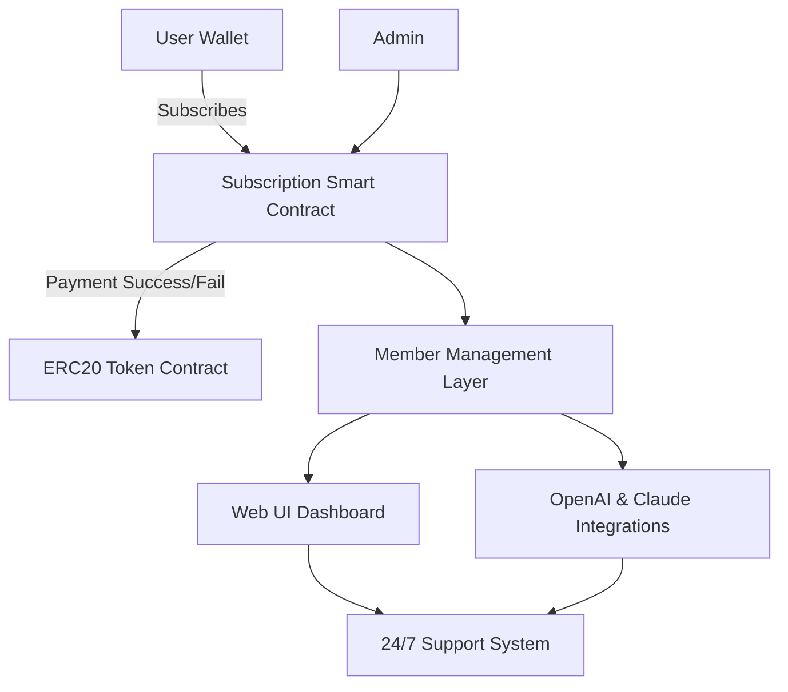

# NAME: token-subscription-management-evm

**Smart Subscription Solutions for ERC20 Tokens: Secure, Automated, and Extensible**

-----

Welcome to **token-subscription-management-evm**, a dynamic, SEO-friendly dApp solution for managing ERC20 token-based subscription services on EVM-compatible blockchains. This project is the pioneer of modular, customer-oriented subscription frameworks—enabling startups, DAOs, SaaS innovators, and enterprise teams to automate tokenized membership, product access, and digital rights management.

## :rocket: **Download**

## :bulb: Table of Contents

- Overview
- Key Features
- Mermaid Diagram
- Example Profile Configuration
- Example Console Invocation
- Emoji OS Compatibility Table
- Subscription Model Advantages
- SEO-Smart Concepts
- OpenAI & Claude API Integrations
- Multilingual, Responsive UI, and 24/7 Support
- License
- Disclaimer

---

## 📖 Overview

**token-subscription-management-evm** bridges the gap between decentralized finance and the recurring revenue business model. It allows project owners to set up, automate, and manage recurring subscription payments, access control, and member lifecycles using ERC20 tokens—all backed by transparent smart contracts and a resilient, modular architecture.

- **Built for the future of the subscription economy**
- **Runs on any EVM-compatible chain (Ethereum, Polygon, BNB Chain, etc.)**
- **Integrates easily with OpenAI and Claude for intelligent automation**

## ✨ Key Features

- 🏛️ **Decentralized Subscription Plans**: Fully on-chain subscription management with flexible ERC20 payment terms.
- 🛡️ **Automated Payment & Renewal**: Handles recurring payments seamlessly; non-payment disables access securely.
- 🏷️ **Multi-Tier Memberships**: Supports multiple membership levels, discounts, and loyalty bonuses.
- 🌀 **Pluggable Integrations**: Native hooks for OpenAI and Claude AI for analytics, personalization, or support chatbots.
- 📲 **Responsive UI**: Fully modern, device-agnostic user interface—perfect on mobile, desktop, or tablet.
- 🌐 **Multilingual Support**: Serve users in their preferred language.
- ⏰ **24/7 Customer Support Mode**: AI-driven ticketing and FAQ handling any time of day.
- 🧩 **Extensible Design**: API for new payment methods, NFT-gated access, and customizable authorization logic.
- 🔒 **Security-First**: Rigorous contract logic, audit hooks, and emergency admin controls.

---

## 📊 Mermaid Diagram

---

## ⚙️ Example Profile Configuration

Configuration files are YAML-based for clarity and pluggability. Below is a sample user profile for setting up a project’s subscription plan:

    subscription:
      planName: "Pro Builder"
      tier: 2
      tokenAddress: "0x..."
      paymentFrequency: "30d"
      amount: "50"
      features:
        - "24/7 AI support"
        - "Priority network access"
        - "Unlimited API usage"
      aiIntegration:
        enabled: true
        provider: "OpenAI"
      multilingual: ["en", "es", "fr"]

---

## 🖥️ Example Console Invocation

Run the main tool to deploy a subscription plan via CLI:

    token-subscription setup \
      --plan "Pro Builder" \
      --token "0xTokenAddress" \
      --frequency 30d \
      --amount 50 \
      --ai OpenAI \
      --languages en es fr \
      --ui responsive

---

## 🧑‍💻 Emoji OS Compatibility Table

| OS     | 🌟 Supported | 🛠️ Notes                            |
|--------|:-----------:|:-------------------------------------|
| 🪟 Win |     ✅      | Full, with PowerShell terminal       |
| 🍎 Mac |     ✅      | Full, native Unix CLI                |
| 🐧 Linux |   ✅      | Ubuntu, Debian, Fedora, Arch friendly|
| 📱 iOS |     👌      | Mobile UI only; CLI remote           |
| 🤖 Android |  👌    | Mobile UI via browser or PWA         |

---

## 🌱 Subscription Model Advantages

Token-powered subscriptions revolutionize digital commerce:
- Ensure **continuous utility** to customers using programmable incentives.
- Provide **predictable revenue** and granular telemetry on membership dynamics.
- Grow communities organically—onboard with tokens, automate renewals, and reward retention.

## 📈 SEO-Smart Concepts

Accelerate organic visibility with these built-in concepts:
- **Decentralized Subscription Framework**: The first open platform for token-native SaaS recurring payments.
- **ERC20 Token Management for Subscriptions**: Connect product access and billing to ERC20s.
- **Web3 Membership Automation**: Unlock the power of programmable communities with blockchain reliability.
- **Next-Generation On-chain SaaS**: Future-proof your subscription platform, compatible with top APIs.

## 🤖 OpenAI & Claude API Integration

**Cutting-Edge Automation:**  
Seamlessly tap into the combined intelligence of OpenAI and Claude to automate support, analyze member activity, and customize experiences—all while keeping user data on-chain and secure.

**Integration Benefits:**
- NLP-powered support chat
- Proactive customer journey mapping
- Membership churn prediction
- Adaptive onboarding and multi-language help

Configuration is as simple as toggling options in your profile YAML—no vendor lock-in.

---

## 💻 Responsive UI, Multilingual Support, 24/7 Customer Support

Every subscription interface is crafted with accessibility and universality in mind:

- **Responsive Web UI:** Enjoy a seamless experience on any device—designed to be visually harmonious across resolutions.
- **Multilingual Ready:** Localizations available out of the box; easily extend to any language.
- **24/7 Support System:** Always-available AI & human fallback ensures no membership question is left unanswered.

---

## 📜 License

Distributed under the [MIT License](./LICENSE).  

Released in 2026 for interoperable, secure growth of the blockchain ecosystem.

---

## ⚠️ Disclaimer

This repository is intended for informational and prototyping purposes. No part of the codebase or integrations guarantee compliance with local regulations. Always review contracts and perform independent audits before deploying to mainnet. The maintainers disclaim all warranties to the extent permitted by law. Use at your own risk.

---

## 📥 **Download**

---

**Innovate your recurring revenue model—on-chain, intelligent, unstoppable!**  
© 2026 token-subscription-management-evm project.